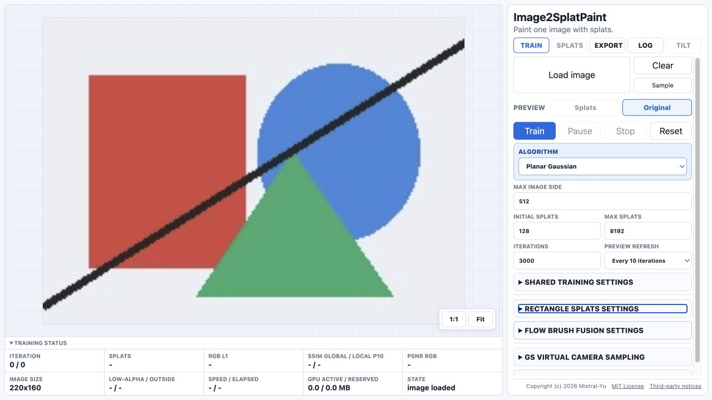

<div align="center">
  <h1>Image2SplatPaint</h1>
  <p><strong>Recreate or stylize an image with trainable splats.</strong></p>
  <p>Runs directly in your WebGPU browser.</p>
  <p>
    <a href="https://mistral-yu.github.io/image2splatpaint/web/index.html"><strong>Launch the app</strong></a>
    ·
    <a href="#quick-start">Quick start</a>
    ·
    <a href="#algorithms">Algorithms</a>
    ·
    <a href="#development">Development</a>
  </p>
  <p><code>WebGPU</code> <code>Browser-only training</code> <code>MIT</code></p>
</div>

<p align="center">
  
</p>

## Project direction

Image2SplatPaint explores image reconstruction and painterly stylization with
trainable splats. Planar and Virtual Camera modes focus on reproduction;
Rectangle, Illustrative Brush, and Flow Brush Fusion turn the same image into
layered geometric or curved paint forms.

## Quick start

1. Choose an **Algorithm**. Setting changes apply to the next Train.
2. Select **Load image**, use **Sample**, or drop an image on the canvas.
3. Set **Max image side**, splat counts, and **Iterations**, then select
   **Train**. Use **Pause** or **Stop** if needed.
4. Compare **Original** and **Splats**. Metrics help with reconstruction modes;
   visible paint and stroke structure matter more for stylized modes.
5. Open **Export** to save the current rendering as PNG. Gaussian results can
   also be saved as a standard 3DGS PLY; virtual-camera results can be inspected
   in **Tilt**.

## Requirements and privacy

> [!IMPORTANT]
> Training requires a WebGPU-capable browser and GPU. The maintained release
> target is current desktop Chrome on macOS.

Larger image and splat limits can use substantial GPU memory and take longer to
finish. The page shows a visible explanation and retry action when WebGPU cannot
be initialized.

Loaded images, training state, previews, and generated results are processed
locally in the browser. The app has no image-upload or analytics endpoint.
GitHub Pages still serves the static application files, and browser or hosting
logs are outside the app's control. Training state is not persisted across a
reload, so save PNG or PLY results you want to keep.

## Algorithms

| Algorithm | Purpose | Exact export | Tilt |
| --- | --- | --- | --- |
| `Planar Gaussian` | Stable front-view approximation of one image | PNG and standard 3DGS PLY | No |
| `Rectangle Splats` | Rectangle, trapezoid, triangle, or legacy Illustrative Brush shapes | PNG | No |
| `Flow Brush Fusion` | Curved strokes fused from compact Brush Splats | PNG | No |
| `GS Virtual Camera Sampling` | Thin-depth 3DGS-style training from front and virtual teachers | PNG and standard 3DGS PLY | Yes |

All four choices run locally with WebGPU and share the main splat optimizer by
default. `Rectangle Splats` keeps the former Brush path as its `Illustrative
Brush` shape. `GS Virtual Camera Sampling` is the only mode that enables
virtual-camera teachers and the `Tilt` tab.

Flow's default `Shared dabs + birth links` learns each Brush's position, size,
and rotation. Split/clone ancestry preserves soft 3–9-dab groups; unrelated
births remain independent. The fixed coverage backcoat is protected from
growth, relocation, and pruning. `Initial splats` counts trainable dabs;
`Max splats` includes the backcoat. `Iterations` counts actual optimizer updates.
Neither public path traces source curves. `Backcoat size variation` defaults to
40%; 0% uses uniform cells.

`Single-Splat internal bend (experimental)` instead learns a curve inside each
Splat. It starts at `Initial splats` and progressively grows the active GPU set
to `Max splats` while preserving existing optimizer history.

The selector configures the next run. Once a result exists, Export eligibility
and Tilt availability stay bound to that completed result until Reset, Clear,
image replacement, or a new completed run.

<details>
<summary><strong>Advanced Rectangle behavior</strong></summary>

`Rectangle Splats` exposes `Min` and `Max` values for
`Short edge / long edge`. `1 / 1` keeps the current rectangular kernel.
Lower values taper the short parallel edge while the opposite edge stays at
full width: `0` allows triangle tips, and `0 <= Min <= Max <= 1` distributes a
deterministic mix of triangles, trapezoids, and rectangles across the paint
layers. Optional Rectangle-only controls can preserve each footprint area
while tapering, point the narrow edge toward stronger local structure, prefer
the selected Max ratio in flat regions, and use a harder narrow edge with a
softer wide edge. `1 / 1` retains the existing Rectangle training path.
`Learned opacity (before gradient)` bounds each Rectangle's trainable opacity
to `0.005...0.995`. `Directional opacity multiplier (short / long)` changes
linearly from the trapezoid's short edge to its long edge.
`Center-to-edge opacity multiplier` independently changes from Max at the
center to Min at the perimeter. Final opacity is
`learned opacity × directional multiplier × center-to-edge multiplier`.
The default `1 / 1` for both multipliers preserves the former uniform behavior.

### Illustrative Brush shape settings

Choose `Illustrative Brush` from the Rectangle `Splat shape` control to use the
former Brush Splats path. Its settings apply at the next Train start.
Experimental checkboxes remain off by default. Equal directional endpoints are
treated as a uniform/no-taper setting, so the defaults retain the accepted
Brush path.

| Setting | What it changes |
| --- | --- |
| `Learned opacity (before gradient)` | Bounds each trainable Brush opacity to Min...Max in the safe `0.005...0.995` range. The default is `0.995 / 0.995`. |
| `Directional opacity multiplier` | A fixed `0...1` end-to-end multiplier; it is not trained. The default `1 / 1` is uniform. |
| `Center-to-edge opacity multiplier` | A fixed `0...1` multiplier from Max at the center to Min at the Brush perimeter. It can be combined with the directional multiplier; both multiply learned opacity in training, preview, standard-alpha overlap, and PNG export. The default `1 / 1` is uniform. |
| `Aspect ratio (long side / short side)` | Sets Brush-specific Min and Max anisotropy in one row. Defaults are `1 / 8`; both values override the Shared `Max anisotropy` behavior during Brush training. |
| `Train directional width taper` | Learns a separate taper amount per splat between the configured directional Min and Max widths. Equal endpoints disable the directional change; the default `1 / 1` preserves the prior untapered path. |
| `Local color-flow orientation` | Softly aligns nearby directional splats when their colors and paint layers are similar. Broad patches and strong direction crossings are excluded. This is experimental. |
| `Directional stroke aspect floor` | Softly maintains a minimum long/short ratio while preserving footprint area. `Ribbon minimum` defaults to `2.2`; `Accent minimum` defaults to `2.8`; Base Patches are unchanged. These are lower bounds, while `Maximum long / short ratio` is the upper bound. This is experimental. |

The general Brush Min/Max applies to every Brush splat. When Directional stroke
aspect floor is enabled, Ribbon and Accent additionally use their stronger
family-specific minimums, capped by the Brush Max.

New Brush detail children always inherit their parent's paint layer. They can
move later through the shared contribution-aware layer training; the former
birth-time one-layer promotion has been removed. When layer training moves a
Paint splat forward, stale RGB is repaired from its source-image footprint
before the new order becomes visible.

The former training-teacher preprocessing, saturation gradient, Brush Line
layer, Brush-profile choices, and rejected Sector-aware, optical-smoothing, and
residual-matching experiments are not part of the product UI. Their comparison
records remain in the local Brush experiment registry.

</details>

## Input images

The app probes supported image headers before decoding. Large supported images
use a bounded decoder when available and are cached at no more than 4096 pixels
on the long side. `Max image side` is a separate training-time resize. The
status bar reports the current cached or training size, not the pre-cache source
dimensions. Decoder support varies by browser; the app retains a guarded
fallback for formats without bounded decode support. Training resize and GPU
estimates use the decoded display orientation, so EXIF-rotated images keep the
same aspect ratio when Train starts.

## Training feedback

The status area reports progress, splat count, image quality, coverage, speed,
elapsed time, and tracked GPU use. Optional live quality updates are off by
default because full-image evaluation can slow training. The shared
`Monochrome underpainting` option begins with lightness and switches to RGB at
the selected point; final quality metrics always evaluate the RGB result.

## Exports

- PNG exports the current rendered or painted result for every algorithm.
- Splat PNG resolution can use the training size, 2K, 4K, or a custom long side
  while preserving the trained image aspect ratio.
- Standard SH0 3DGS PLY is available for the two Gaussian algorithms.
  Rectangle, Illustrative Brush, and Flow use paint-specific structures and
  therefore export PNG only.

PLY results are learned from one image and prioritize its front view. Virtual
Camera Sampling supports bounded tilt, but does not replace true multi-view
geometry or view-dependent color.

## Development

Open `index.html` directly or serve the repository as static files. Before
publishing, run:

```sh
npm run verify
```

GitHub Pages publishes the reviewed static app. Training uses the custom WebGPU
implementation; `Tilt` uses a pinned self-hosted
[PlayCanvas Engine](https://github.com/playcanvas/engine) build. See
[Third-Party Notices](THIRD_PARTY_NOTICES.md). This project is developed and
validated with AI assistance.

## Research inspiration

Image2SplatPaint takes inspiration from
[Image-GS](https://arxiv.org/abs/2407.01866),
[Soft Anisotropic Diagrams](https://luckyiyi.github.io/SAD/index.html), and the
paint flow of [wet-paint-flow](https://github.com/simonxxooxxoo/wet-paint-flow).
Its implementation and layered paint design are developed independently.

## Roadmap

- Improve faithful image representation for the Planar Gaussian and Virtual
  Camera paths.
- Develop Rectangle, Illustrative Brush, and Flow as distinct paint media.
- Improve training methods for paint-oriented effects, stroke structure, and
  controllable visual character.
- Improve compatibility with conventional 3D Gaussian Splatting workflows.

## License

Image2SplatPaint is released under the [MIT License](LICENSE).
